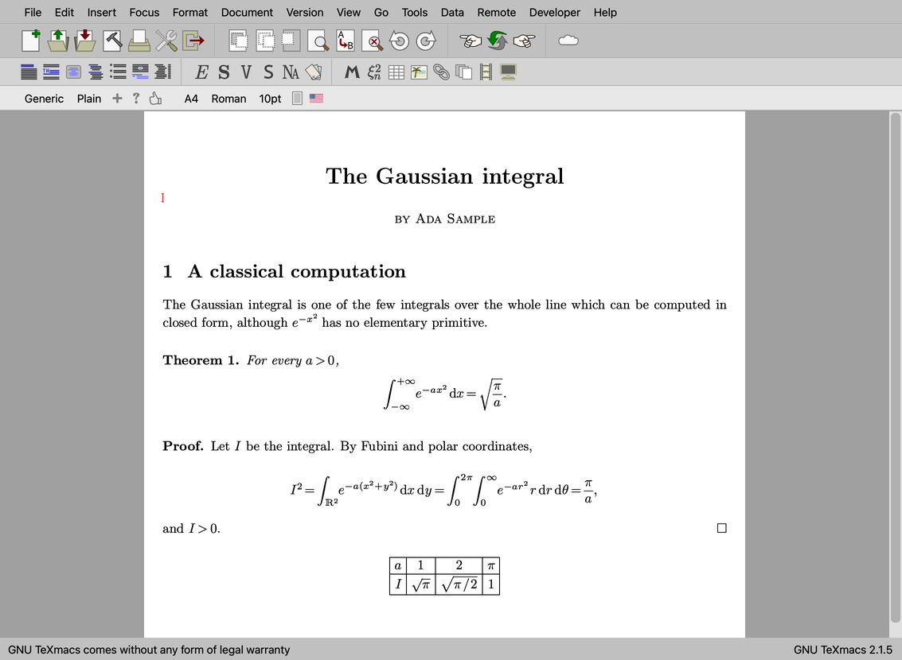
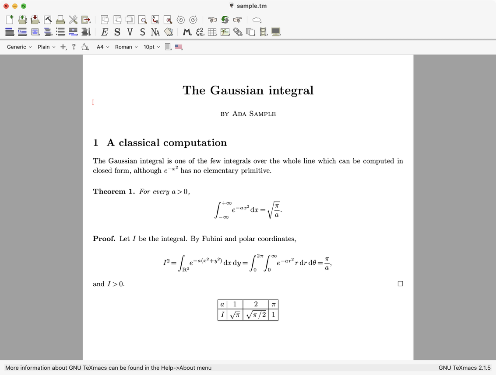
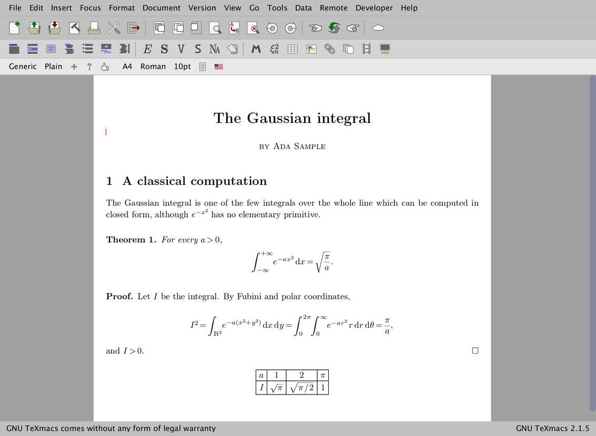
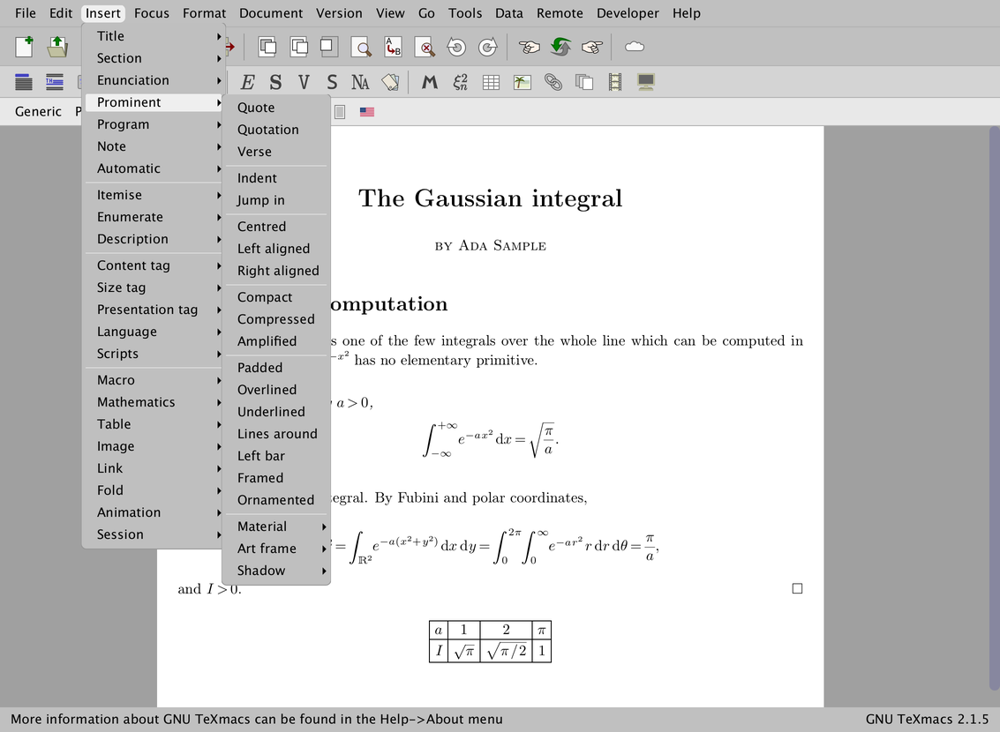
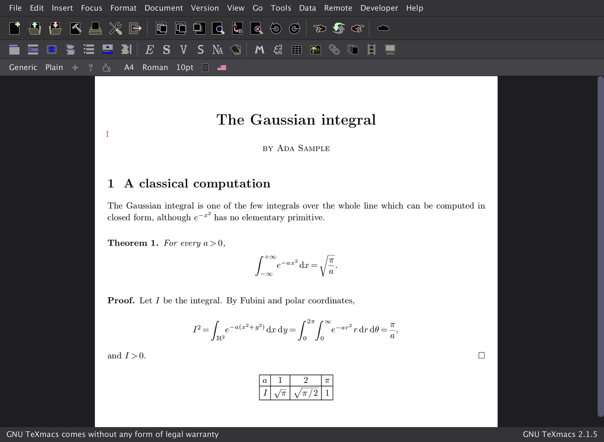
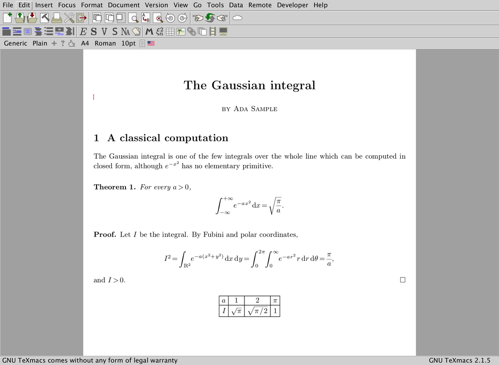

# GNU TeXmacs — branch `wip_other_guis`

Work in progress: the graphical interfaces of [GNU TeXmacs](https://texmacs.org)
other than the Qt one. TeXmacs draws its documents itself and asks a GUI
plugin only for windows, menus, bars, dialogs and events (see
[how the core talks to a GUI plugin](src/docs/texmacs-gui-architecture.md)),
so one editor can have several faces. This branch brings back or adds:

* **Vue**, an interface which owes nothing to a widget toolkit: it draws
  the editor, the bars, the menus, the dialogs and the tools itself, on
  [Clay](https://github.com/nicbarker/clay) for the layout, SDL3 for the
  windows and the input, and MuPDF for the pixels;
* **Cocoa**, a native macOS interface, the NS port of 2013/2018 brought
  forward to the current TeXmacs;
* **SDL**, the Widkit widgets of the X11 interface on SDL3 and MuPDF;
* **Qtwk**, the Widkit widgets on Qt as a window system, and fixes to the
  **X11** interface.

Outside the plugins it is stock TeXmacs (the `svn_sync` branch, the mirror
of the SVN trunk), save for the places which had to learn that the GUI is
not always Qt, and fixes which serve every interface (the MuPDF renderer,
the preferences, windows which stay above the editor windows...).

The interface is chosen when configuring, from `src/`:

| `./configure --with-gui=` | Interface | Code |
|---|---|---|
| `qt` (default) | Qt 5/6 with native Qt widgets: the standard TeXmacs | `src/src/Plugins/Qt` |
| `cocoa` (or `aqua`) | native macOS (NS) | `src/src/Plugins/NS` |
| `vue` | SDL3 windows, widgets drawn by Clay, MuPDF rendering | `src/src/Plugins/Vue` |
| `sdl` | SDL3 and MuPDF, Widkit widgets | `src/src/Plugins/SDL` |
| `qtwk` | Qt as the window system, Widkit widgets | `src/src/Plugins/Qtwk` |
| `x11` | plain X11, Widkit widgets | `src/src/Plugins/X11` |

`./configure --help` describes them too, and
[build-and-debug.md](src/docs/build-and-debug.md) says what each needs
(Guile 1.8, MuPDF for Vue and SDL, the X11 headers...).

## The interfaces

The screenshots show one document, [sample.tm](src/docs/screenshots/sample.tm),
in each interface, in the window each one opens with, taken on a Mac at 2x
and reduced to 1x.

### Qt — the reference

The interface of the TeXmacs releases, shown as the reference the others
are compared with: the menus, the three icon bars (main, mode and focus),
the footer, the dialogs of Qt. The Scheme code of TeXmacs is written for
it, and the other interfaces follow what it does. (A Qt 6 build of the
same TeXmacs, 2.1.5.)

### Cocoa — native macOS

A native AppKit interface, in Objective-C++: the menus are those of the
menu bar of the Mac, the icon bars, the side tools, the tabs, the dialogs
and the file choosers are Cocoa views and panels, and the documents are
drawn with Core Graphics. It follows the Qt interface feature by feature,
with the Dock and the Finder (opening files, quitting). A universal
application (arm64 and x86_64) for macOS 12 and later is built as a DMG by
the CI (`.github/workflows/macos-ns.yml`, on the branch `ns_ci`). Status,
known gaps and testing aids: [doc/ns-port.md](doc/ns-port.md).

### Vue — a toolkit of its own

Every pixel of the window is drawn by TeXmacs: Clay lays the widgets out
anew at each frame (immediate mode), MuPDF renders them and the documents
into one backing store, and SDL3 only brings the windows, the events, the
clipboard and the input methods. The widgets follow those of Qt (menus as
on the Mac, combo boxes which can be typed in, tabs, lists, side tools),
at the density of each window, with animated highlights and rounded
corners. Nothing in it depends on a platform: the same code runs in a
browser (branch `wip_wasm_vue`). A single-window mode
(`TEXMACS_VUE_SINGLE_WINDOW=1`) keeps the dialogs and the tools inside the
main window, as in the browser.

The menus and the submenus are drawn in the window too, with the column
of the check marks, the shortcuts, and scroll markers when they do not
fit.

The colours come from a theme, light or dark, which follows the system
(or the "gui theme" preference, or `TEXMACS_VUE_THEME`), with a dark set
of the vector icons.

Developer notes: [the graphics stack](src/docs/vue-graphics-stack.md),
[the widgets](src/docs/vue-widgets.md), [the test harness](src/docs/vue-testing.md)
(scripted events and snapshots, some fifty tests in
`src/src/Plugins/Vue/tests/`).

### SDL — the Widkit widgets on SDL3

The widgets of the X11 interface (Widkit, drawn by TeXmacs itself) on
SDL3 windows, with MuPDF as the renderer: the classic look of TeXmacs
without X11. Its event loop, its text input and its clipboard are made as
those of Vue.

### Qtwk and X11

Not shown. Qtwk puts the same Widkit widgets on Qt windows. The X11
interface is the historical one of TeXmacs, and needs an X server (XQuartz
on a Mac), which was not available where the screenshots were taken. Both
build on this branch, and have the changes made to Widkit for the other
interfaces (side tools on both sides of the canvas, windows kept above the
editor windows).

## Documentation

* [src/docs/](src/docs/README.md): the Vue plugin, how the core talks to a
  GUI plugin, building and debugging, the PDF output with MuPDF, a design
  for separating the editor from its front end
* [doc/ns-port.md](doc/ns-port.md): the Cocoa interface

## This repository

The layout is the one of the TeXmacs SVN trunk, which this is a mirror of:

| Directory | Contents |
|---|---|
| [`src/`](src/README.md) | the editor: sources, Scheme, styles, documentation, packaging. **Its [`README.md`](src/README.md) is the README of the project** |
| `doc/` | notes on the Cocoa interface |
| `misc/` | build scripts, plugins and other odds and ends |
| `web/` | the sources of the web site |
| `guile-texmacs/` | the vendored Guile 1.8 |
