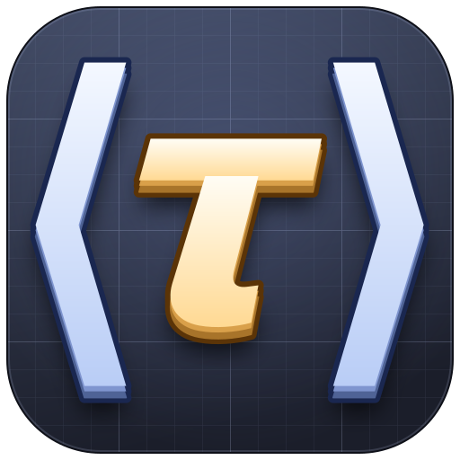
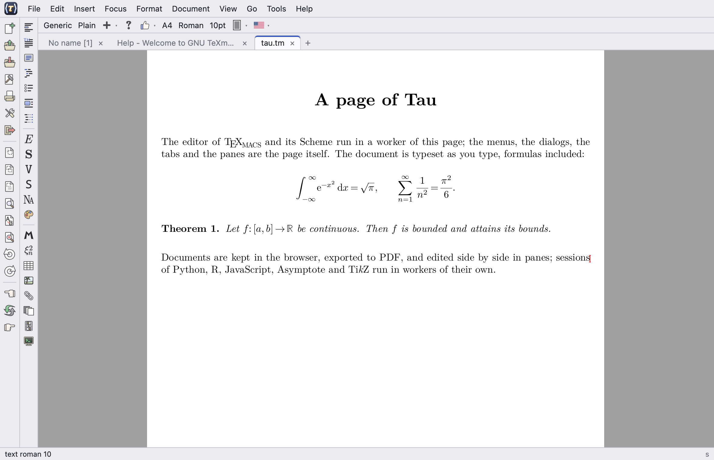

# Tau — branch `wip_tau`



**Tau** is an experiment with [GNU TeXmacs](https://texmacs.org) in the
browser, organised differently from the other ports: the editor, the
typesetter and the Scheme interpreter run in a **Web Worker**, without
any widget or window, and the interface — the menus, the icon bars, the
dialogs, the tabs and the panes — is **the page itself**, written in
JavaScript and HTML. The two sides exchange messages; the documents are
drawn by the worker (MuPDF) and shown in canvases.



It branches from [`maxs_texmacs`](https://github.com/mgubi/texmacs/tree/maxs_texmacs)
and is free to break with its organisation: it is not kept in sync with
it. The design, the decisions taken and the state of the work are in
[`src/docs/tau-design.md`](src/docs/tau-design.md).

## What is different

| | The other ports | Tau |
|---|---|---|
| Interface | widgets drawn by a toolkit (Qt, Vue...) in the program | HTML of the page; the program describes menus and dialogs as data |
| Where the program runs | the thread of the interface | a worker: the page stays responsive |
| Windows | objects of the program, with their bars and menus | none: a view is shown at a *place*, a number; panes and tabs are of the page |
| Fonts | TeX fonts (Metafont, Type 1) and OpenType | OpenType only; Latin Modern in the place of the TeX fonts |
| Graphical plugins | Qt, Cocoa, X11, SDL, Vue, Ghostscript... | removed; MuPDF draws and writes the PDF |
| Scheme | Guile or S7 | S7 |

## What works

- Editing in one or several **panes** side by side, the documents as
  **tabs**; the menus, the icon bars (as columns at the left, or above),
  the context menu, the footer, the tools at the sides and under the
  views, the search bar.
- **Dialogs** made from the descriptions of TeXmacs (preferences, the
  font selector, the macro editor...), with documents shown and edited
  inside them; questions; tooltips over a document.
- The **keyboard** as in the other ports: shortcuts from the place of
  the keys, dead keys and input methods through a text area of the page.
- **Documents kept in the browser** (IndexedDB), opened from and given
  back to the computer; export to PDF; Print and Preview in a tab of the
  browser; the clipboard of the browser.
- **Plugins** as Web Workers: Python (Pyodide), R (webR), JavaScript,
  Asymptote, TikZ; the client of a remote TeXmacs server over WebSocket.
- The colour menus with **typographic palettes**; full screen and
  presentation modes.

What is missing or rough is listed, step by step, in the design note
(*State*). In short: no tree views, colour pickers or handwriting in
dialogs; panes only side by side; copy gives text only; the keyboard has
been tried on a US keyboard in Firefox and Safari, not on others.

## Building

Emscripten and a slim build of MuPDF for WebAssembly are needed (the
scripts of `src/misc/wasm`, as for the browser build of `maxs_texmacs`:
`emenv.sh`, `build-mupdf.sh`). From `src/`:

```sh
. misc/wasm/emenv.sh build-tau
make -C build-tau -f ../misc/tau/Makefile -j8 MUPDF=<the MuPDF tree> web
make -C build-tau -f ../misc/tau/Makefile MUPDF=<the MuPDF tree> serve   # http://localhost:8080/index.html
```

`web` makes the page in `build-tau/out/web`: the program (`tau.js`,
`tau.wasm`), the files of TeXmacs in packages which are loaded lazily,
the page (`misc/tau/web`) and the workers of the plugins. The programs of
TikZ and Asymptote are fetched at pinned versions; `PLUGIN_PROGRAMS=no`
leaves them out. The target `node` builds the core alone for node, which
converts documents without a page.

In the address of the page: `?bars=top` or `left` (the icon bars),
`?nohome` (nothing is kept in the browser), `?trace-keys` (the keys in
the console), `?arg=…` (an option of TeXmacs, a document to open).

## Tests

```sh
make -C build-tau -f ../misc/tau/Makefile MUPDF=… check          # node
make -C build-tau -f ../misc/tau/Makefile MUPDF=… browser-check  # a browser without a display
```

`check` runs the table of the keys, converts a document to PDF and runs
the test suites of TeXmacs on the core (those which cannot pass in Tau
are listed with their reason in `misc/tau/test/suites-expected.txt`).
`browser-check` drives the page with puppeteer-core (`npm install
puppeteer-core` in `build-tau/tools`) and Firefox or Chrome: the start,
typing, the menus, the dialogs, the tabs and the files, the panes...

## Where things are

| | |
|---|---|
| `src/docs/tau-design.md` | the design and the state of the work |
| `src/src/Tau/` | the core seen from the page: views, the turn of the worker, the messages |
| `src/TeXmacs/progs/kernel/gui/menu-serial.scm` | the menus and the dialogs of TeXmacs as data for the page |
| `src/TeXmacs/progs/texmacs/texmacs/tau-files.scm` | the files of the user, the clipboard, tooltips |
| `src/misc/tau/web/` | the page: `tau.mjs` (views, panes, keyboard), `chrome.mjs` (menus, dialogs), `keys.mjs`, `app.mjs`, the worker |
| `src/misc/tau/test/` | the tests |
| `src/misc/tau/Makefile` | the build |

## Related

- [`maxs_texmacs`](https://github.com/mgubi/texmacs/tree/maxs_texmacs),
  from which Tau branches: TeXmacs with OpenType mathematics, S7, other
  interfaces and a browser version on the Vue interface, where the whole
  program runs in the page and draws its own widgets.
- [Vau](https://github.com/mgubi/vau), the typesetting core of TeXmacs
  as a viewer, from which the choice of fonts and the lazy packages come.
