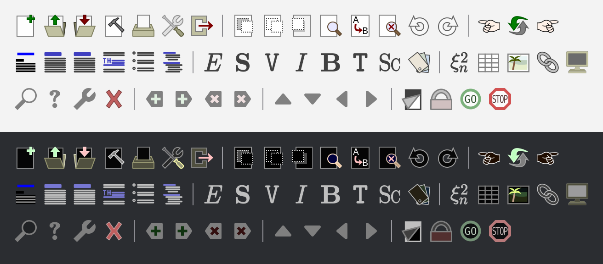
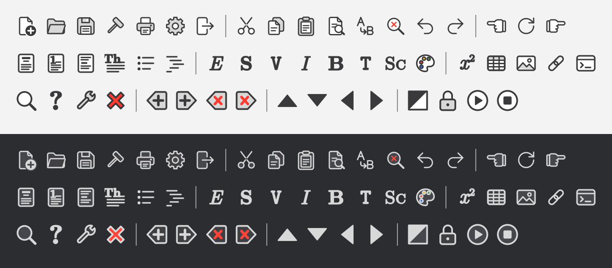
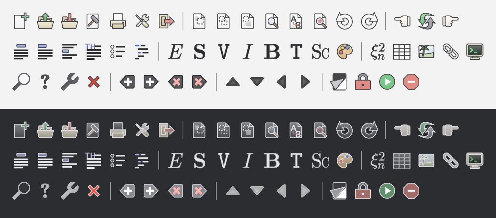

# GNU TeXmacs

[GNU TeXmacs](https://texmacs.org) is a free wysiwyw (what you see is what you want) editing platform with special features for scientists. The software aims to provide a unified and user friendly framework for editing structured documents with different types of content (text, graphics, mathematics, interactive content, etc.). The rendering engine uses high-quality typesetting algorithms so as to produce professionally looking documents, which can either be printed out or presented from a laptop.

The software includes a text editor with support for mathematical formulas, a small technical picture editor and a tool for making presentations from a laptop. Moreover, TeXmacs can be used as an interface for many external systems for computer algebra, numerical analysis, statistics, etc. New presentation styles can be written by the user and new features can be added to the editor using the Scheme extension language. A native spreadsheet and tools for collaborative authoring are planned for later.

TeXmacs runs on all major Unix platforms and Windows. Documents can be saved in TeXmacs, Xml or Scheme format and printed as Postscript or Pdf files. Converters exist for TeX/LaTeX and Html/Mathml. 

## Icon sets (branch `wip_icons`)

This branch gives TeXmacs a choice of three icon sets, in
**Preferences › General › Icon set** (after a restart). The original icons
and the original code that finds them are unchanged; the new sets are added
on top of them.

**Classical.** The original TeXmacs icons, the default.

**Monochrome.** The classical ideas drawn in the manner of the macOS symbols:
filled objects with an outline, in one graphite tint and its light tones, red
kept for errors and removals, letters in Latin Modern.

**Neo-classical.** The compositions and colours of the classical icons,
modernized: a soft palette, light gradients, dark grey outlines, rounded
corners; flat in the focus bar.

The pictures show the main, text and focus toolbars on the light and dark
themes. Every icon of each set, with its name, is in the specimen sheets
[classical.pdf](doc/icons/classical.pdf),
[monochrome.pdf](doc/icons/monochrome.pdf) and
[neoclassical.pdf](doc/icons/neoclassical.pdf).
[doc/icons/README.md](doc/icons/README.md) describes how the sets are chosen
and the scripts that generate them (`misc/icons/`).

## Documentation
GNU TeXmacs is self-documented. You may browse the manual in the `Help` menu or browse the online [one](https://www.texmacs.org/tmweb/manual/web-manual.en.html).

For developer, see [this](./COMPILE) to compile the project.

## Contributing
Please report any [new bugs](https://www.texmacs.org/tmweb/contact/bugs.en.html) and [suggestions](https://www.texmacs.org/tmweb/contact/wishes.en.html) to us. It is also possible to [subscribe](https://www.texmacs.org/tmweb/help/tmusers.en.html) to the <texmacs-users@texmacs.org> mailing list in order to get or give help from or to other TeXmacs users.

You may contribute patches for TeXmacs using the [patch manager](http://savannah.gnu.org/patch/?group=texmacs) on Savannah or by submitting a [pull request](https://github.com/texmacs/texmacs/pulls) on Github.Please note that while we use SVN on Savannah, GitHub serves only as a mirror. To facilitate synchronization, we have a `svn_mirror` branch. Please refrain from submitting pull requests to the `svn_mirror` branch; instead, use the `development` branch as the base to ensure proper merging and integration into the main SVN trunk.
