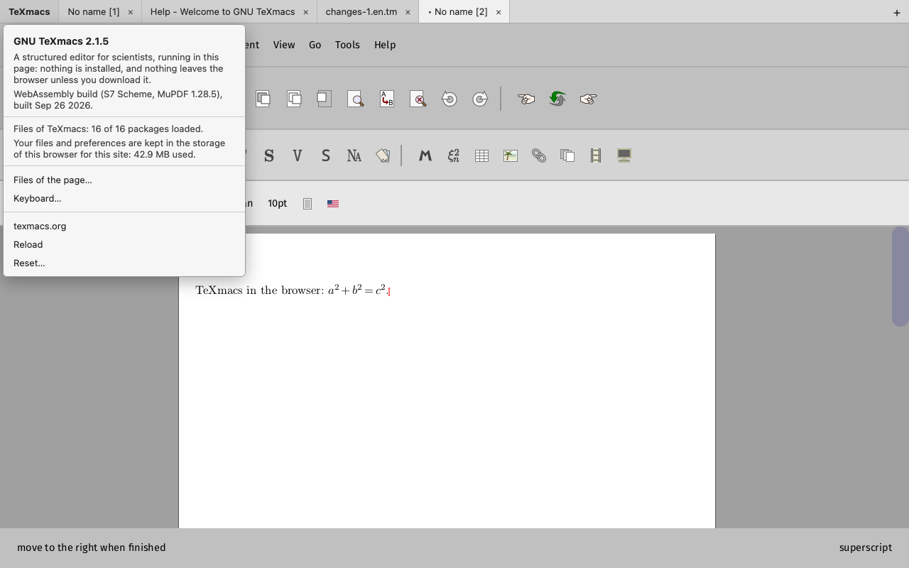

> ## Branch `wip_wasm_vue` — TeXmacs in the browser (TeXmacs Vue)
>
> Work in progress: TeXmacs compiled to WebAssembly and running in a web
> page, an experimental port called TeXmacs Vue. Try it at
> **https://mgubi.github.io/texmacs/** (published by the CI from the branch
> `gh-pages`, which is moved to this one when a state is worth showing:
> `git push origin wip_wasm_vue:gh-pages`). Nothing is installed and nothing leaves the
> browser unless it is downloaded.
>
> 
>
> It is stock TeXmacs on
>
> * the Vue GUI (below) and SDL3, with Emscripten's SDL3 port;
> * the [S7](https://ccrma.stanford.edu/software/snd/snd/s7.html) Scheme
>   interpreter in place of Guile, merged from `wip_s7` of texmacs/texmacs
>   (notes in [`docs/s7/`](docs/s7/README.md)); S7 is also the default of the
>   desktop build on this branch (`--with-scheme=s7|guile`);
> * a slim MuPDF 1.28.5 for the pixels and the PDF output (no fonts of its
>   own but the standard 14, no document formats but PDF, SVG and images).
>
> What the page does:
>
> * **One canvas, many windows.** The browser gives one window, so the
>   windows of TeXmacs become virtual ones: each document is a tab of the
>   frame above the canvas (its name, a dot when modified, × to close, + for
>   a new one, a ribbon which scrolls with the wheel or a drag), and the
>   dialogs float over it with a title bar. The same mode runs on the desktop
>   with `TEXMACS_VUE_SINGLE_WINDOW=1`, which is how it is tested.
> * **The TeXmacs menu** of the page: the version, the state of the files,
>   the storage used, the Files panel, reload and reset.
> * **Files.** *Files of the page…* (also in the File menu) shows the files
>   kept in the browser; files and whole projects (folders, zip archives,
>   with their images) come in by upload or by dropping them on the page,
>   and go out as downloads (a folder as a zip). The open and save dialogs of
>   TeXmacs are this panel. The home directory, with the preferences and the
>   documents, is kept in IndexedDB.
> * **Loading in pieces.** The program is 5.2 MB (brotli) and the files of
>   TeXmacs are packages: 4 MB are needed to start, the other 24 MB come in
>   the background once TeXmacs runs; a file needed before its package is
>   fetched alone (a byte range). Everything is kept in the cache of the
>   browser: a second visit loads nothing.
>
> * **The clipboard of the system**: copy, cut and paste with the other
>   programs (text, and HTML when TeXmacs has it); TeXmacs' own format is
>   kept when a copy is pasted back. On a Mac the shortcuts are Cmd+..., as
>   the browser's.
>
> * **The TeXmacs server**: the Remote menu logs in to a TeXmacs server over
>   WebSocket (the servers of this branch serve WebSocket clients on their
>   usual port), for remote files and shared documents.
>
> Not there yet: plugins and external converters (no processes in a page),
> `wss` for servers elsewhere than on the same machine, resizing the
> dialogs.
>
> Build and try it (Emscripten, tested with 6.0; Python ≥ 3.10; Node):
>
>     . misc/wasm/emenv.sh build-wasm     # the Emscripten environment
>     sh misc/wasm/build-mupdf.sh         # the slim MuPDF, once
>     make -C build-wasm -f ../misc/wasm/Makefile -j8 web
>     node misc/wasm/serve.mjs            # http://localhost:8080/texmacs.html
>
> (`make ... node` builds a headless TeXmacs for node, which converts
> documents to PDF.) Any web server does, but the page loads faster from one
> which sends the brotli copies and answers range requests, as `serve.mjs`
> does. Details, the design and the plan: [`docs/wasm/`](docs/wasm/README.md).
>
> ## Branch `wip_vue` — the Vue GUI
>
> Work in progress: a graphical back end for TeXmacs which owes nothing to a
> widget toolkit. It draws the editor, the bars, the menus, the dialogs and
> the tools itself, on three libraries — [Clay](https://github.com/nicbarker/clay)
> for the layout, SDL3 for the windows, the input and the clipboard, and
> MuPDF for the pixels.
>
> * Code: [`src/Plugins/Vue/`](src/Plugins/Vue/), with its `TODO` and its `tests/`
> * Developer notes: [`docs/`](docs/README.md) — the graphics stack, the
>   widgets, the test harness, how the TeXmacs core talks to a GUI plugin,
>   and how to build and debug it
> * Build: `./configure --with-gui=vue --with-sdl3 --with-mupdf=<prefix>`
>
> Everything outside `src/Plugins/Vue/` and `docs/` is stock TeXmacs, save
> for the few places which had to learn that the GUI is neither Qt nor X11.

# GNU TeXmacs

[GNU TeXmacs](https://texmacs.org) is a free wysiwyw (what you see is what you want) editing platform with special features for scientists. The software aims to provide a unified and user friendly framework for editing structured documents with different types of content (text, graphics, mathematics, interactive content, etc.). The rendering engine uses high-quality typesetting algorithms so as to produce professionally looking documents, which can either be printed out or presented from a laptop.

The software includes a text editor with support for mathematical formulas, a small technical picture editor and a tool for making presentations from a laptop. Moreover, TeXmacs can be used as an interface for many external systems for computer algebra, numerical analysis, statistics, etc. New presentation styles can be written by the user and new features can be added to the editor using the Scheme extension language. A native spreadsheet and tools for collaborative authoring are planned for later.

TeXmacs runs on all major Unix platforms and Windows. Documents can be saved in TeXmacs, Xml or Scheme format and printed as Postscript or Pdf files. Converters exist for TeX/LaTeX and Html/Mathml. 

## Documentation
GNU TeXmacs is self-documented. You may browse the manual in the `Help` menu or browse the online [one](https://www.texmacs.org/tmweb/manual/web-manual.en.html).

For developer, see [this](./COMPILE) to compile the project.

## Contributing
Please report any [new bugs](https://www.texmacs.org/tmweb/contact/bugs.en.html) and [suggestions](https://www.texmacs.org/tmweb/contact/wishes.en.html) to us. It is also possible to [subscribe](https://www.texmacs.org/tmweb/help/tmusers.en.html) to the <texmacs-users@texmacs.org> mailing list in order to get or give help from or to other TeXmacs users.

You may contribute patches for TeXmacs using the [patch manager](http://savannah.gnu.org/patch/?group=texmacs) on Savannah or by submitting a [pull request](https://github.com/texmacs/texmacs/pulls) on Github.Please note that while we use SVN on Savannah, GitHub serves only as a mirror. To facilitate synchronization, we have a `svn_mirror` branch. Please refrain from submitting pull requests to the `svn_mirror` branch; instead, use the `development` branch as the base to ensure proper merging and integration into the main SVN trunk.
