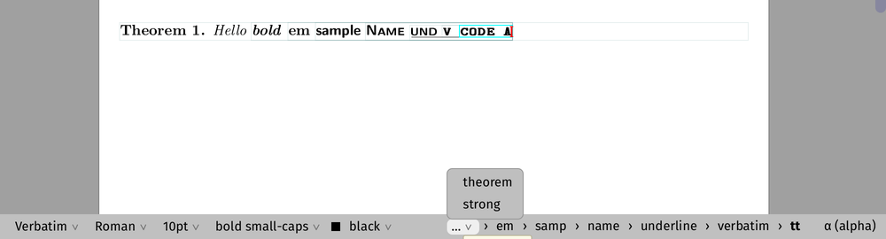

# The interactive status bar

An option of the Vue interface: the status bar (the footer of an editor
window) shows as menus and buttons what it otherwise shows as text.

* **On the left, the properties of the text at the cursor**, each a menu
  which changes it: the language (text mode), the font (the math font in
  a formula), the size, the series and shape when they are not those of
  the document, the colour (a swatch and its name). A small chevron says
  that each is a menu; the menus open upwards, as there is no room below
  the footer.
* **On the right, the tags around the cursor**, from the outermost to the
  innermost (in bold), separated by `›`. A click on one selects it, as a
  click in the context tool (Tools › Context tool) does; a **right click**
  selects it and opens the context menu of the editor on it, its Focus
  menu (rename, remove, variants, preferences of the tag...), at the
  pointer. `document` and `concat`, which say nothing, are left out.
* **Folding.** The outer tags which do not fit in the room of the path
  fold into a `…` menu (a click on one of them selects it); the innermost
  tags stay in view. If the path is still too wide (a narrow window) it is
  clipped on its left, never on its right.
* **What is before the cursor**, after the path, as the text footer says
  it: the character, `start`, `space` (`apply` in a formula), a symbol and
  its name (`α (alpha)`).
* **Messages stay text.** While the editor shows a message (the help of
  a LaTeX or hybrid command, a temporary message, the welcome messages at
  start-up) or asks a question in the footer, the status bar is the text
  it always was.

It is off by default: **View › Interactive status bar** (Vue only, shown
while the status bar is), the preference `interactive footer` (`on` or
`off`).

## How it works

| Where | What |
|---|---|
| `TeXmacs/progs/texmacs/menus/footer-menu.scm` | The two menus, `texmacs-footer-environment` and `texmacs-footer-path` (lazy menus, declared in `init-texmacs.scm`). They reuse the menus of the Format menu (`text-font-menu`, `math-font-menu`, `font-size-menu`, `text-font-effects-menu`, `color-menu`) and `text-language-menu`; the tags are those of `upward-context-trees` (`main-menu.scm`, the context tool). The folding: `footer-split-path` keeps the innermost tags which fit in `footer-path-budget` characters (the character after the path and the `…` menu count too); the GUI sets the budget (`footer-set-budget`). The character: `footer-char-info`, as `compute_text_footer` |
| `src/Edit/Interface/edit_footer.cpp` | `edit_interface_rep::set_footer` says, before it sends the footer, whether it is the environment at the cursor or a message: `(footer-environment-notify #t/#f)` |
| `TeXmacs/progs/kernel/texmacs/tm-dialogue.scm` | `(footer-environment?)`, that state. A function and not an exported variable: an exported variable is a copy of the binding of the module, which a `set!` in the module does not change |
| `src/Plugins/Vue/vue_widget.cpp`, `vue_texmacs_widget_rep` | At `SLOT_LEFT_FOOTER` (sent first) it reads the preference and `(footer-environment?)`; at `SLOT_RIGHT_FOOTER` it expands the two menus and rebuilds the widget of each only when its expansion changed (`update_footer_menus`, as `tm_window_rep::get_menu_widget` does for the tool bars). The footer then lays out the environment menu on the left and the path on the right, right-aligned; when the path is wider than its room it is shifted left by the difference measured in the last pass, so that its end stays in view. The width of the path in the last layout (`footer_room`, points, at some 7 points a character) is the budget given to Scheme before the menus are expanded |
| `vue_widget.cpp`, `in_footer` | Set while the footer is laid out: the buttons are flatter (the footer is lower than the tool bars), the pull-down buttons get a chevron (`layout_arrow`), and a right click on a button (a tag) runs its command, then `footer_popup_command_rep`, which opens `texmacs-popup-menu` (the Focus menu of the selection) in a popup window at the pointer, as `edit_interface_rep::mouse_adjust` does for a right click in the document |
| `misc/wasm/browser-run.mjs` | `rclick x y`, a right click, for the tests |

The only change outside Vue and the Scheme menus is the notification in
`set_footer`, which the other interfaces ignore.

## Possible improvements

* **The font name in its own face**, and the swatch of a pattern or a
  gradient (the swatch is a plain colour).
* **Hover feedback in the document.** Hovering over a tag of the path
  could outline it in the document (as the focus rectangle does), so that
  it is clear what a click selects.
* **The selection.** While a selection is active the path is that of the
  cursor; it could show the tag selected, and the properties could apply
  to the selection (the menus already do, as the Format menu).
* **Mathematics and programs.** In a formula the left side shows `Math`
  and the math font; the math font size, the math style (display or
  inline) and the program language of a session could be menus too.
* **The context menu** is placed at the pointer and kept in the window
  (in the browser) or on the screen (desktop): near the bottom of a
  desktop window it hangs below the footer; it could open upwards as the
  menus of the footer do. The folding budget is an estimate (7 points a
  character); measuring the names would be exact.
* **Other interfaces.** Nothing in the menus is Vue specific: Qt could
  show them as well, through a slot for the footer (the editor would send
  the widget, as it sends the tool bars) instead of the reading of
  `(footer-environment?)` in the GUI.
* **Performance.** The two menus are expanded at every update of the
  footer (every key); the tool bars are too, but the expansions could be
  skipped while the cursor stays in the same tag and environment.
