# OpenType MATH support in TeXmacs (branch `wip_opentype`)

This branch teaches TeXmacs to typeset mathematics with the data an OpenType
math font carries in its `MATH` table, instead of the hand-made
constructions and the per-font tables that TeX-style fonts require. It
started from the partial support written by Ke Shi for Mogan (OSPP 2024),
itself built on a MATH table reader written for TeXmacs in 2021, and was
continued here: the parser was hardened, the constants were put to work in
the typesetter, stretchable glyphs were made to follow the specification,
and the whole thing was layered *under* the hand-tuned tables rather than in
place of them.

The rule that shapes the design: **the hand-tuned tables win.** `adjust_*.cpp`
and the TeX Gyre and STIX branches of `unicode_font.cpp` are crafted against
TeXmacs's own layout and keep precedence wherever they say anything; the MATH
table fills what they leave open. A switch turns the tuning off for
comparison, from Scheme with `(set-hand-tuned-math-fonts #f)` or from the
sample script with `TM_HAND_TUNED=off`.

Two companion documents go deeper: `doc/font-system-review.md` reviews the
font system as a whole, and `doc/opentype-math-design.md` is the design and
status log of this work, including everything that is still missing.

## What is implemented

**The MATH table** (`Plugins/Freetype/tt_tools.{hpp,cpp}`). A reader for
`MathConstants` (the 51 value records and the five plain integers),
`MathGlyphInfo` (italic correction, top accent attachment, extended shape
coverage, the kerning that cuts scripts into a glyph's corners) and
`MathVariants` (vertical and horizontal variants, and the glyph assemblies
with their connector lengths and minimum overlap). NULL sub-table offsets
are honored, which fonts without `MathKernInfo` need.

**Font activation** (`Plugins/Freetype/unicode_font.cpp`). A font with a MATH
table sets `font_rep::ot_math` and about forty parameters converted from
design units through `units_per_EM`: the axis, the fraction and radical
geometry, the limit and stretch-stack geometry, the script shifts and drops,
the accent base heights, the bar constants and the script percentages. This happens *before* the
per-family branches, so a hand-tuned font overwrites what it tunes and keeps
the rest.

**Glyph-level corrections.** Italic corrections and the MathKern cut-ins are
exposed as height-aware hooks (`get_*_correction_at`) on `font_rep` and as
`*_correction_at` on boxes, so a script is kerned against the shape of the
base at the height where it actually sits, which is what the specification
asks for.

**Stretchable glyphs** (`Plugins/Freetype/rubber_unicode_font.cpp`).
Delimiters, radicals, wide accents, braces and long arrows are chosen by
target size from the variants of the table, and beyond the largest variant
they are assembled from the parts, with the connector overlaps the table
prescribes and the lengths measured on the glyphs. Assemblies are defined as
ordinary virtual-font glyph algebra, so both the bitmap and the vector paths
draw them, and they export as the font's own glyphs.

**The typesetter.** Fractions, radicals, limits, scripts, delimiters, wide
accents, over- and underlines and the labels on stretched arrows take their
geometry from the table when the font has one: script placement with the
baseline drop limits and `subSuperscriptGapMin`, extended shapes, script
sizes from `scriptPercentScaleDown`, display operators picked by
`displayOperatorMinHeight` and capped at two em, accents placed at the top
accent attachment points, the radical rule flush with the top of the sign and
the degree tucked in by `radicalKernAfterDegree`.

**GSUB and GPOS.** The single and alternate substitutions of one feature are
read and exposed as glyph variants: `dtls` for dotless letters under accents,
`flac` for flattened accents over tall bases, `ssty` for the script-size
alternates, applied through a font decorator at script levels. Pair kerning
is read from the GPOS `kern` feature, both explicit pairs and class matrices:
no OpenType math font ships a legacy `kern` table, so before this every one
of them was set with no kerning at all.

**Font profiles** (`Graphics/Fonts/math_font_profiles.cpp`,
`TeXmacs/progs/fonts/fonts-opentype.scm`). What the MATH table cannot say:
the text, sans serif and typewriter companions of a math font, whether math
letters come from the math font or from the text italic, the family (roman
or sans serif) its text is set in, a file of a text companion the database
may not know, and the menu label and section. Twenty-four fonts are
profiled, each declared with `define-math-font-profile`. A companion is
named the way the `font` environment variable names a font, by its master
(a family is accepted too and mapped to its master). A text family typesets
its formulas in its math companion and the other way round, and sans serif
and typewriter text and mathematics use the declared companions. A profiled
math font which is installed but in no database, as the math fonts of TeX
Live are, is added to the local database the first time it is asked for,
and so is the directory of its `text-file`. Bold mathematics uses a real
bold face when the database attaches one to the master of the math font;
the `bold-math` key is recorded but not consulted.

**Choosing fonts** (`fonts-opentype.scm`, `generic/document-edit.scm`,
`fonts/font-short-menu.scm`). The font button of the focus toolbar offers
the installed profiled fonts under the names LaTeX users know, in a Serif
section (Latin Modern, New Computer Modern, Times, Palatino, Bookman,
Schoolbook, STIX Two, Libertinus, Kp Fonts, Utopia, Charter, Euler,
Concrete, DejaVu), a Sans serif section (Fira, Kp Sans, Computer Modern
Sans, Lete Sans) and a submenu of the others (XITS, Asana, IBM Plex,
Garamond, Old Standard, GFS Neohellenic); `Document > Font > Mathematical
font` lists them all at its end. `init-opentype-font` sets the text font,
the math font and the family. Formulas follow the math companion of the
text font, not `math-font`, which counts only with the text font `roman`,
so a math font which is not the companion of its text font (Euler Math and
Asana Math with Pagella, KpMath Sans with Kepler) is written as a rule,
`math=Euler Math,TeX Gyre Pagella`. The TeX Gyre entries go through the
`*-font` style packages of their hand-tuned mathematics.

**Shipped fonts** (`TeXmacs/fonts/truetype`). Latin Modern Math with LM
Roman, Sans and Mono; New Computer Modern Math regular and bold with the
NewCM10 faces (its Sans and Mono are not shipped); STIX Two; KpMath, KpMath
Sans and their bold faces with KpRoman, KpSans and KpMono (0.66); Fira Math
0.3.4 beside Fira Sans and Mono; Libertinus Math with Serif, Sans and Mono;
Erewhon and XCharter with their math fonts; Concrete Math with the Concrete
faces of CM Unicode; Euler Math, set with TeX Gyre Pagella. The TeX Gyre
Pagella, Termes, Bonum and Schola Math fonts and the first STIX fonts were
shipped before. All their text and math faces are registered in the global
database, so they work in a fresh installation without a scan (the size
and integral fonts of the first STIX are loaded by file name, as before). Rescanning a
complete database went from minutes to about two seconds by skipping files
already recorded.

**Finding the fonts** (`Plugins/Freetype/tt_file.cpp`,
`Graphics/Fonts/font_database.cpp`). A font is looked for in its sfnt form
before its Type 1 form: a TeX distribution ships many families in both, and
the Type 1 file carries the encoding of the TeX world, which turned the text
of XCharter into nonsense. The local database of `$TEXMACS_HOME_PATH` is
merged with the shipped one whenever the latter has changed, or the
installation is another one, or the local one has lost entries, which
`$TEXMACS_HOME_PATH/fonts/shipped-stamp.scm` records; without that, a home
directory written before a version registered new fonts never saw them, and
a character only those fonts draw came out as its own name in red.

**Symbols** (`TeXmacs/langs/encoding/tmuniversaltounicode-extra.scm`,
`TeXmacs/progs/math/math-symbol-tools.scm`). Two hundred symbols of the
`unicode-math` list which TeXmacs could not name are named, with the class
that gives them their spacing in `std-symbols.scm` and the LaTeX name that
carries them through conversion in `latex-symbol-drd.scm`. They are reachable
from the palettes, from a window of all the symbols (Insert ▸ All symbols…)
and from a side tool (Insert ▸ Symbols in a side tool), whose groups are
declared once with `define-math-symbols-group` and laid out for the width of
each. Every symbol button draws with the smart font, so a palette can show a
symbol which lives in no TeX font, and says its markup in a balloon.
`doc/math-symbol-coverage.md` counts what is still unnamed.

**OpenType features of text** (`Graphics/Fonts/feature_font.cpp`,
`TeXmacs/progs/fonts/font-features.scm`). The GSUB reader serves ordinary
text fonts too: old style figures, small capitals, the stylistic sets and
the other single substitutions a font offers are applied through the
environment variable `font-features`, from `Document > Font > Features`,
`Format > Font features` and a column of the font browser, which lists the
features of the font it will really use.

**Seeing what the font system decides** (`Graphics/Fonts/smart_font.cpp`,
`TeXmacs/progs/fonts/font-debug.scm`). Emulation is how TeXmacs lets any
font be used for mathematics, so the question is less whether a glyph is
emulated than being able to see it. `Tools > Fonts > Font inspector` opens a window that stays above the
editor windows, follows the cursor or the mouse and reports the route, the
file and the MATH path of one glyph, read from the routing tables without
resolving anything. From it, the glyphs can be coloured by the route they
took (the debug switch `fonts`, which acts on drawing only) and the font
report opened, a document attached to the document being edited
(`tmfs://fontdbg/...`), which lists every
character of the typeset document by route and says which emulated glyphs a
PDF export draws as bitmaps. With the tools off, layout is untouched and
drawing tests one flag per string.

**Documentation in TeXmacs.** `Help > Manual > Fonts` gathers the page on
choosing fonts, the user section *Mathematical fonts*
(`TeXmacs/doc/main/math/fonts/`: how the math fonts work, every shipped font
with a sample and a table of its characteristics, the fonts to install) and
the reference chapter *Fonts, from selection to glyph*
(`TeXmacs/doc/devel/fonts/`).

### Where the code is

| File | What it does |
|---|---|
| `Plugins/Freetype/tt_tools.{hpp,cpp}` | MATH, GSUB and GPOS readers |
| `Plugins/Freetype/tt_face.{hpp,cpp}` | parsed tables cached per face, kerning |
| `Plugins/Freetype/unicode_font.cpp` | activation, constants, corrections |
| `Plugins/Freetype/rubber_unicode_font.cpp` | variants and assemblies |
| `Graphics/Fonts/font.{hpp,cpp}` | the MATH parameters and the hooks |
| `Graphics/Fonts/smart_font.cpp` | routing, math italic letters, profiles |
| `Graphics/Fonts/feature_font.cpp` | a font seen through a GSUB feature, and the features a document asks for |
| `Graphics/Fonts/math_font_profiles.cpp` | the profile table |
| `Graphics/Fonts/poor_rubber.cpp` | the emulation, now behind the table |
| `Typeset/Boxes/Composite/math_boxes.cpp` | radicals, bars, wide accents |
| `Typeset/Boxes/Composite/script_boxes.cpp` | scripts, limits, stretch stacks |
| `Typeset/Concat/concat_math.cpp` | delimiters, big operators, arrows |
| `Typeset/Env/env_semantics.cpp` | script sizes, `ssty` at script levels |
| `Plugins/Freetype/tt_file.cpp` | the order the font files are looked for |
| `Graphics/Fonts/font_database.cpp` | the local database and the shipped one |
| `Texmacs/Window/tm_button.cpp` | the font a symbol button is drawn with |
| `Plugins/Qt/qt_ui_element.cpp` | a symbol button outside a menu |
| `TeXmacs/progs/fonts/fonts-opentype.scm` | the profiles, the font menus, `init-opentype-font` |
| `TeXmacs/progs/fonts/font-short-menu.scm` | the text fonts of the focus bar menu |
| `TeXmacs/progs/fonts/font-features.scm` | the menus and the browser column of the features |
| `TeXmacs/progs/generic/document-edit.scm` | `init-font` |
| `TeXmacs/progs/generic/document-menu.scm` | the Document and focus bar font menus |
| `TeXmacs/fonts/font-{database,features,characteristics}.scm` | the shipped font database |

## Building and testing

The tests need a built tree. On macOS with Homebrew, configure with Guile 1.8
first on the path and libpng visible, or the native PDF renderer is silently
left out and every exported glyph becomes a bitmap:

```
PATH=/path/to/guile-1.8/bin:$PATH ./configure \
  'CPPFLAGS=-I/opt/homebrew/opt/libpng/include/libpng16 -I/opt/homebrew/include'
make SAFE_TEXMACS_REV && make
```

Then, from the top of the tree:

```
make -C tests                                   # 18 binaries, 143 tests
TM_TEST_FONT_DIR=/path/to/fonts tests/opentype/check.sh    # tests + renders
tests/opentype/compare-lualatex.sh              # against unicode-math
tests/opentype/font-gallery.sh                  # the specimens below
```

Without `TM_TEST_FONT_DIR`, 19 of the tests skip; pointing it at
`TeXmacs/fonts/truetype` runs them all but the one that needs Asana Math,
which is not shipped. `tests/README.md` describes each
script, including the pixel diff against the reference renders in
`tests/build/ref`, when that directory exists.

## The fonts, one specimen each

Every image below is the same three lines: letters, Greek and digits;
scripts, a fraction, radicals and nested delimiters; big operators with
limits, wide accents, an overbrace and a labelled arrow. They were produced
with

```
TM_TEST_FONT_DIR=/path/to/extra/fonts tests/opentype/font-gallery.sh -w 900
```

on a machine with TeX Live installed, so they show the fonts that were
installed there: the script asks TeXmacs which profiled math fonts it finds
and renders those. On another machine it produces the gallery of that
machine's fonts.

### References, without the MATH path

The TeX fonts have no MATH table at all, and STIX v1 is driven by its
hand-tuned tables. Both are here to compare against.

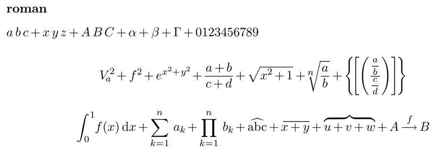

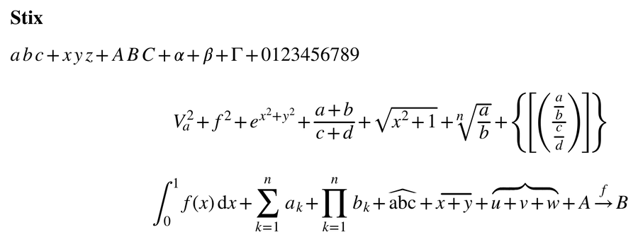

### Shipped with TeXmacs

These are in `TeXmacs/fonts/truetype` and need no font scan. They take
the MATH path with no hand tuning, so they exercise everything described
above. In the font menu they are Latin Modern, New Computer Modern, STIX
Two, Libertinus, Kp Fonts, Utopia, Charter, Euler and Concrete among the
serif fonts, and Fira and Kp Sans among the sans serif ones.

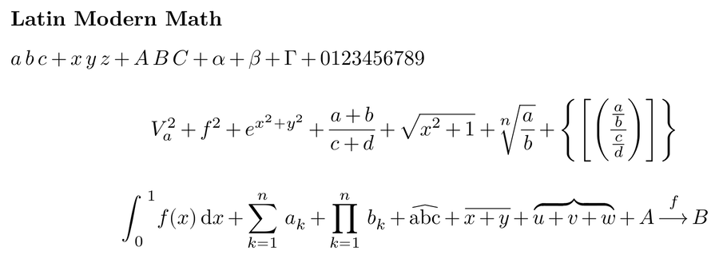

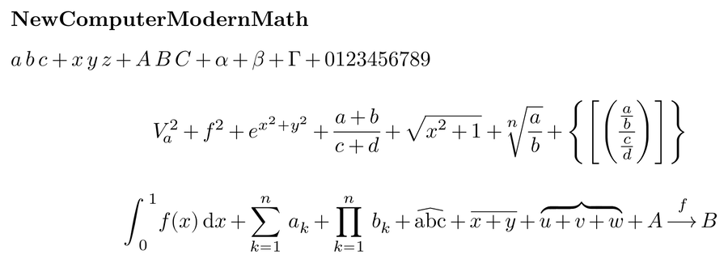

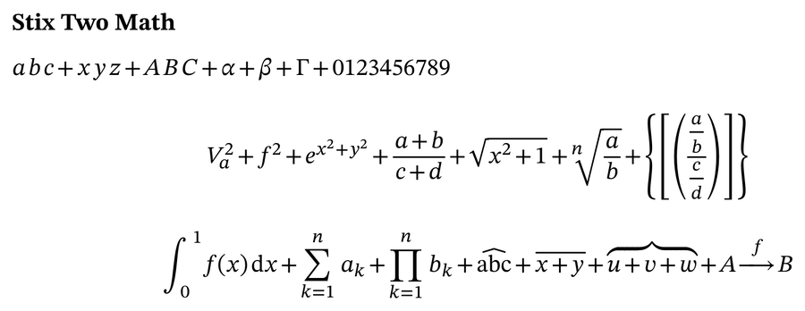

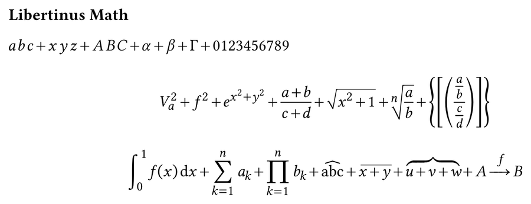

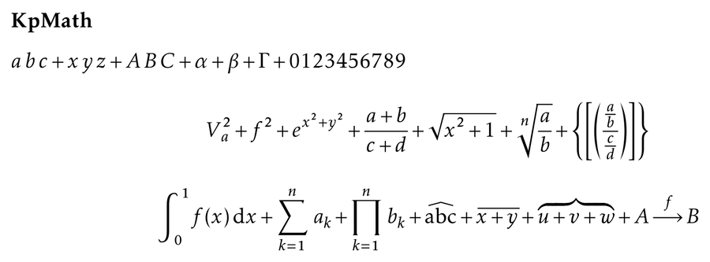

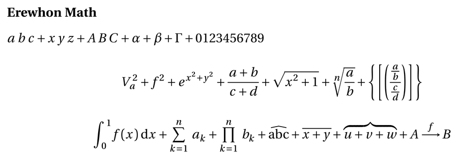

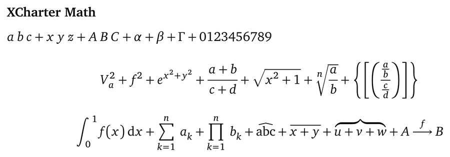

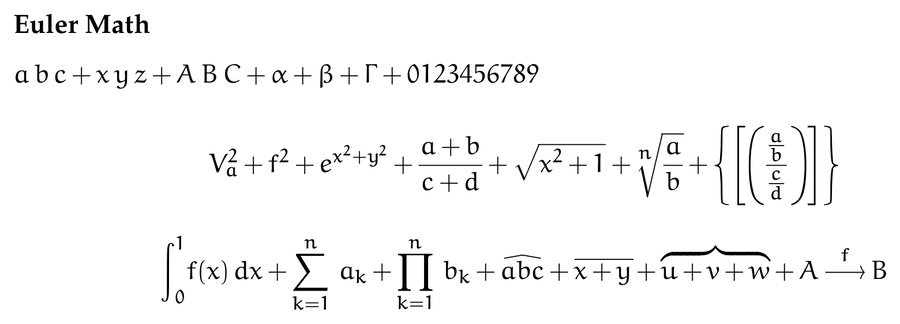

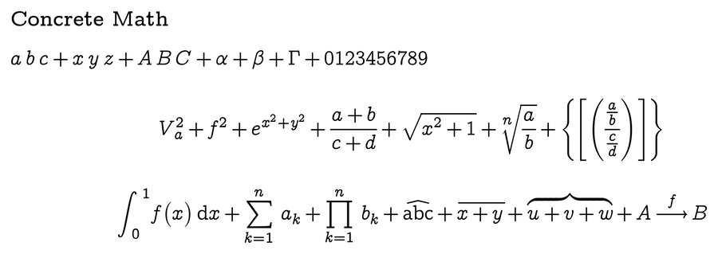

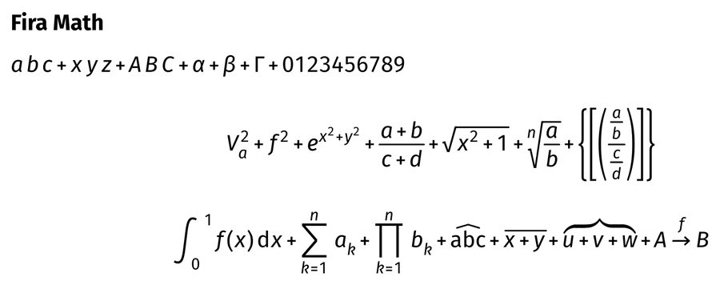

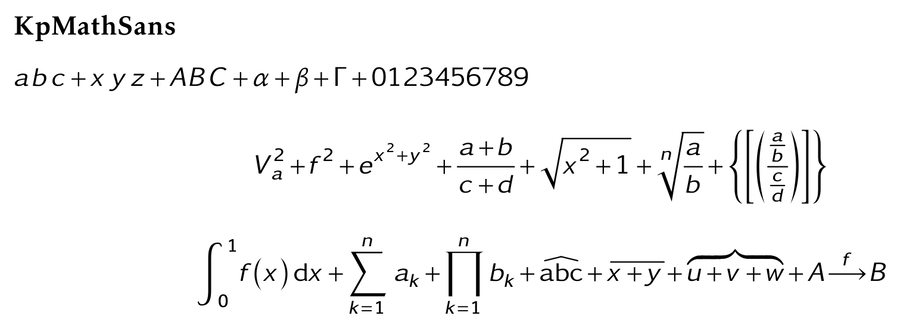

### TeX Gyre

Pagella, Termes, Bonum and Schola are shipped too, and keep their
hand-tuned tables for corrections, wide accents and integrals, while the
MATH table gives them the delimiter variants, the assemblies and the
constants they never had; the menu calls them Palatino, Times, Bookman and
Schoolbook. TeX Gyre DejaVu Math is not shipped; it has no tuned tables and
takes the MATH path like the fonts above. Its display integral is about one
and a half em, as the font designs it and as LuaLaTeX draws it, rather than
the tall integral of New Computer Modern or STIX Two.

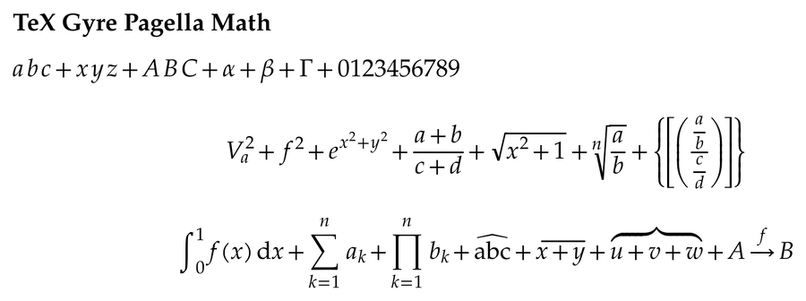

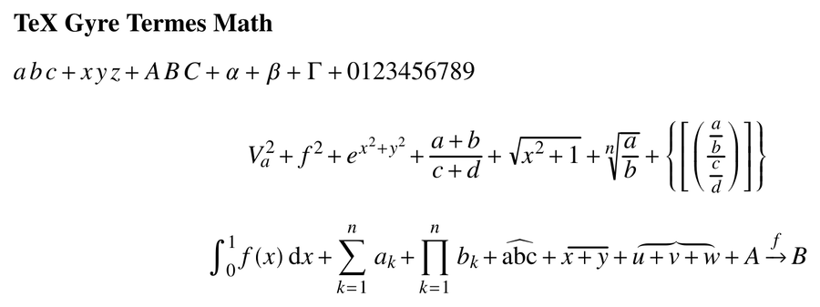

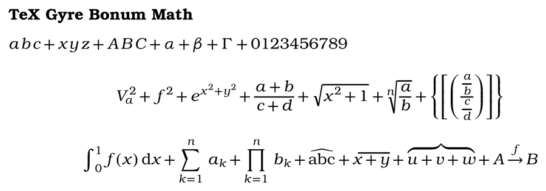

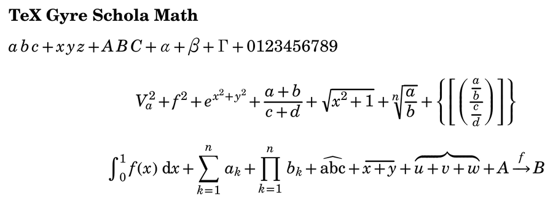

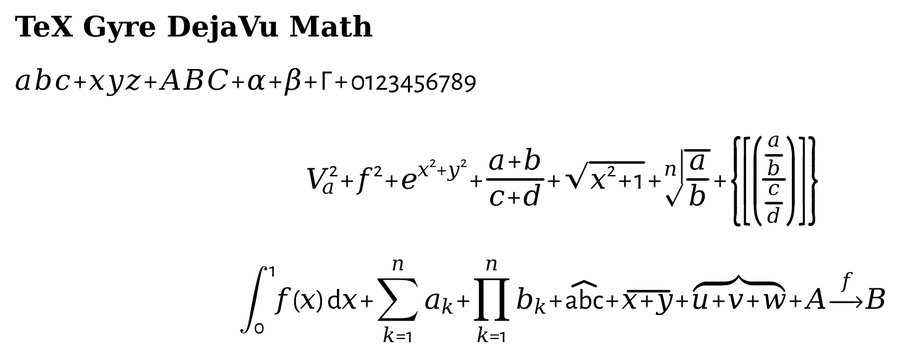

### Other profiled fonts

Profiled and untuned, not shipped: they are used as soon as they are
installed, and their quirks are the fonts' own. XITS is a complete family,
superseded by STIX Two; Asana is a Palatino set with Pagella text; IBM Plex
Math is the font whose display operators needed the two-em cap; New
Computer Modern Sans Math and Lete Sans Math serve sans serif mathematics;
GFS Neohellenic has 41 percent of the alphanumerics. Garamond-Math and
Old Standard Math are profiled too, with no specimen here.

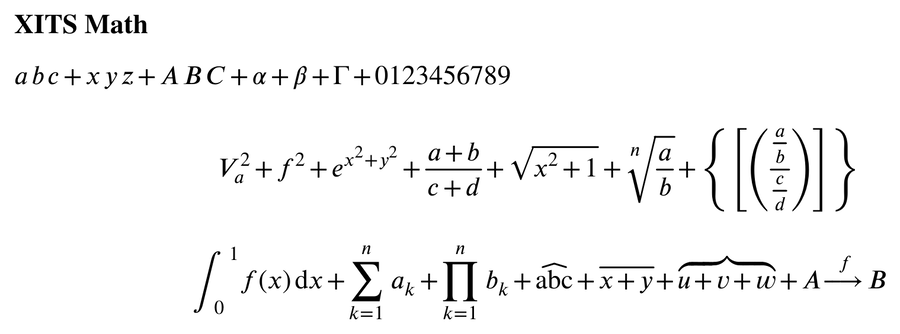

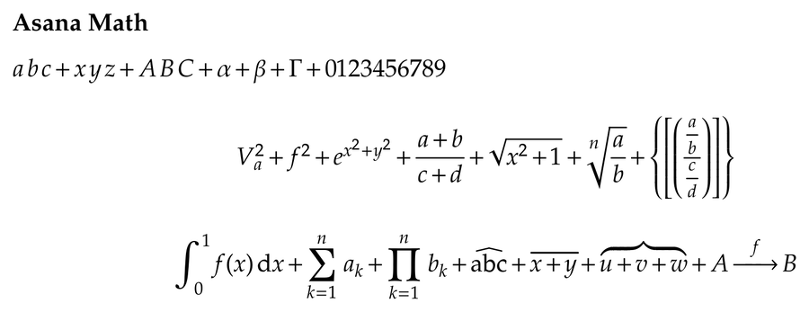

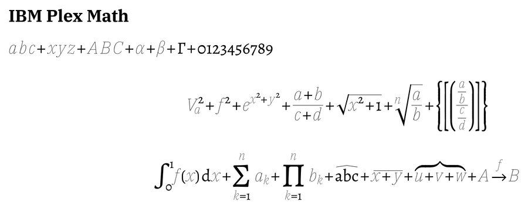

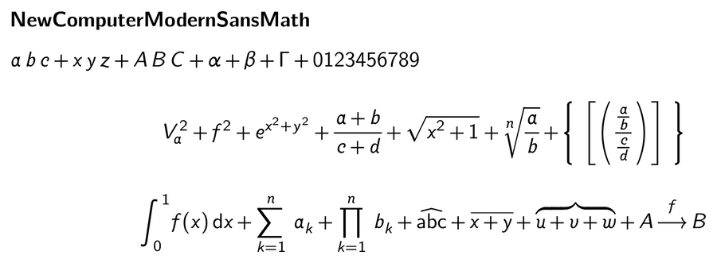

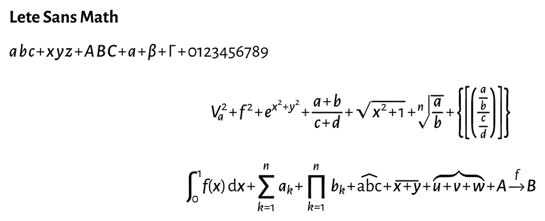

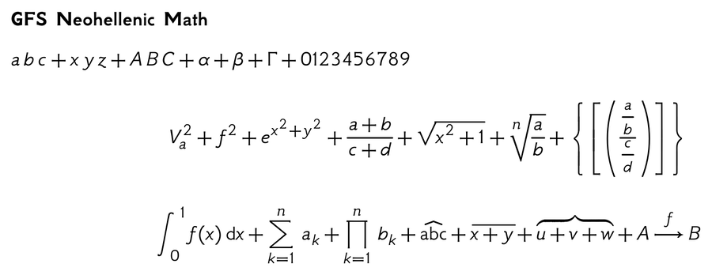

## What is not done

The short version, with the details in section 7 of
`doc/opentype-math-design.md`:

- Alphabets a font provides only in part (script and double-struck in most
  fonts) are silently mixed with the emulated ones; no profile key declares
  what a font really has.
- `delimitedSubFormulaMinHeight`, the device tables and the plain stack
  constants for `above` and `below` are deliberately not applied: the first
  would diverge from TeX, the device tables only matter for small sizes on
  the screen, and the stack constants would move every such construct.
- The rest of GPOS (mark attachment, cursive and contextual positioning) is
  unused, which affects fonts that
  place accents with `mark`/`mkmk` rather than with the top accent
  attachment.
- The profile test checks each math font, its family name and its MATH table,
  but not that the companion masters a profile names exist or are installed.
- Six symbols which only TeXmacs defines (`triangleup`, `blacktriangleup`
  and the four `nblacktriangle...`) are drawn by pixel operations and still
  export as small bitmaps when the font lacks them. Every other symbol an
  OpenType math font lacks is either built as vectors or, when its
  emulation would be a bitmap, taken from the shipped STIX Two Math; glue
  and the MATH assemblies are vectors.
